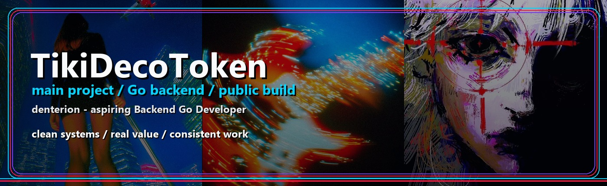
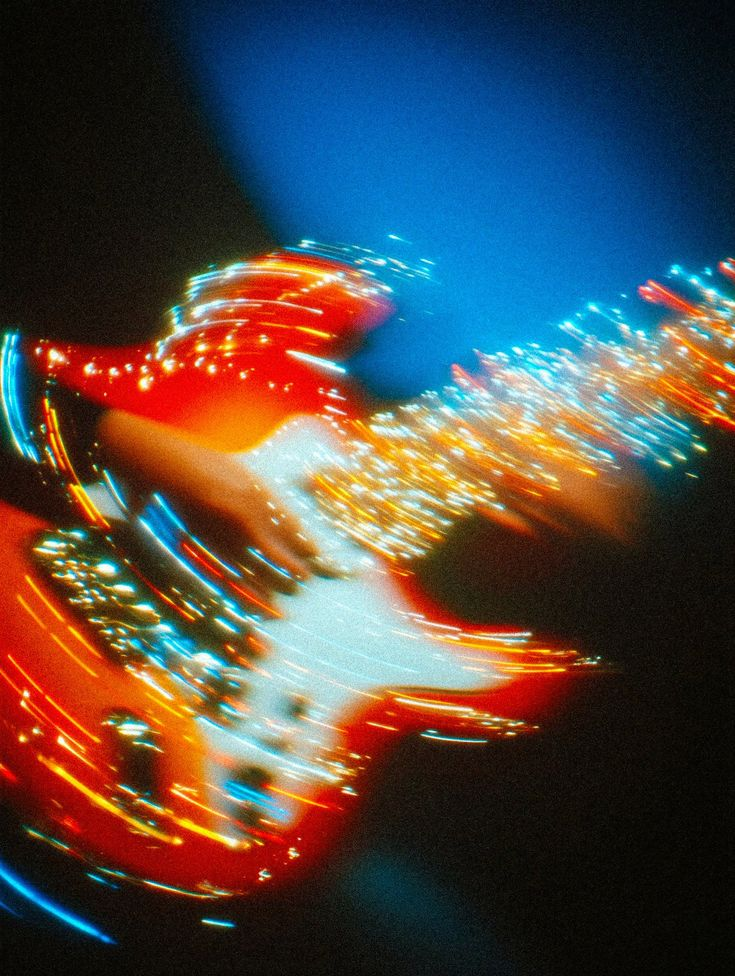
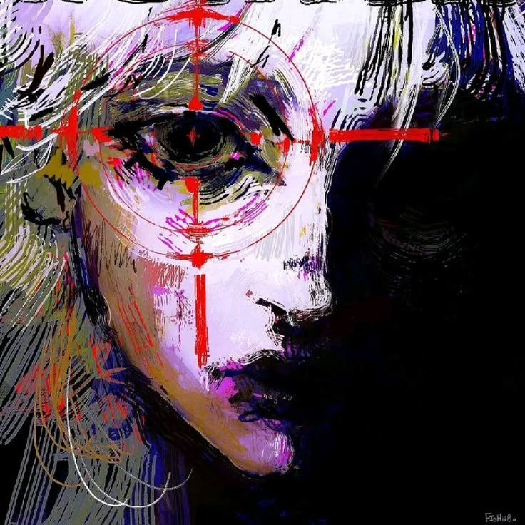

  

<h1 align="center">denterion</h1>

  Student - Aspiring Backend Go Developer - TikiDecoToken builder - Go backend systems

  
  

  
  

---

## About

I am a student and aspiring **Backend Go Developer** focused on real engineering practice: APIs, databases, containers, service communication, message brokers, and clean backend architecture.

I am not interested in building only polished demos. I want to understand how useful systems are designed, developed, tested, deployed, and improved over time.

My current direction is **Go backend development** with a practical product mindset: write clear code, understand the system, ship useful features, and keep improving. The project I am most focused on right now is **TikiDecoToken**: a public crypto/IT repository where I practice engineering discipline, documentation, transparent project communication, and product thinking.

> Discipline turns ideas into systems. Engineering turns systems into products.

---

## Tech Stack

  
  
  
  
  
  
  
  
  
  
  

**Backend:** Go, REST API, gRPC, PostgreSQL, Redis, Kafka  
**Infrastructure:** Docker, Git, GitHub, Linux basics  
**Frontend:** Basic HTML, CSS, and JavaScript when a project needs a simple interface  
**Interests:** distributed systems, microservices, algorithms, system design, and production-ready products

---

## Main Project: TikiDecoToken

<table>
  <tr>
    <td width="54%">
      <h3>TikiDecoToken / TIDE</h3>
      

        <b>TikiDecoToken</b> is the project I want people to check first on my GitHub profile.
        It is a crypto and IT project connected with a future hospitality concept, digital utility research,
        token development, public documentation, and transparent project communication.
      

      

        The current public direction is careful and evidence-based: a Sepolia testnet prototype, public reports,
        release preparation, utility-pilot documentation, and open project review boundaries.
      

      

        <b>What I practice here:</b> smart-contract repository structure, release discipline, public docs,
        project positioning, review gates, and building a product narrative without unsupported claims.
      

      

        
      

    </td>
    <td width="46%">
      
    </td>
  </tr>
</table>

  
  
  
  

---

## Selected Backend Projects

| Project | What it is | Main focus |
| --- | --- | --- |
| **TikiDecoToken** | Public crypto/IT project around TIDE, documentation, Sepolia prototype work, release preparation, and utility-pilot planning | Product engineering, transparency, token repository discipline |
| **job-aggregator** | Go service for collecting and processing Go vacancies with scraper, processor, Kafka transport, PostgreSQL storage, and a delivery layer | Backend pipelines, parsing, filtering, Kafka, PostgreSQL |
| **Event-Driven Notification Platform** | Go backend system using gRPC, Kafka, PostgreSQL, Redis, and Docker | Event-driven architecture, service communication, message processing |
| **Task Tracker** | Go + PostgreSQL CRUD application with Docker and a simple frontend | API design, database operations, full-cycle backend practice |
| **Personal Portfolio Website** | Personal developer website with projects and contacts | Personal brand, project presentation, basic frontend |

---

## Current Focus

- Making **TikiDecoToken** the main project people notice and review on my profile
- Building stronger backend projects with **Go**
- Improving API design, database design, and service architecture
- Learning distributed systems, microservices, and system design
- Practicing Docker-based development workflows
- Making my GitHub portfolio more serious and useful
- Improving English for professional communication and future international opportunities

---

## Goals

- Become a strong **Go Backend Developer**
- Get an internship or junior backend developer position
- Build serious open-source and portfolio projects
- Improve English to a high professional level
- Create projects with real value, not just demo code
- Study abroad in the future, especially in Italy
- Grow as an independent developer and product-minded engineer

---

## Visual Direction

  
  
  

I like a visual style that feels like night city lights, contrast, focus, and motion: a little cinematic, a little technical, but still clean enough for a developer profile. For TikiDecoToken, I want the visual mood to feel energetic, public, and product-oriented.

---

## Beyond Code

I am interested in startups, crypto and real-world digital products, fitness, discipline, languages, travel, and books. Italy and Japan are two countries I would like to explore more deeply, and I enjoy Haruki Murakami and fantasy literature.

---

## Contact

  

  Open to backend development opportunities, internships, collaboration, and serious portfolio projects.

---

  <b>Clean systems. Real value. Consistent work.</b>

